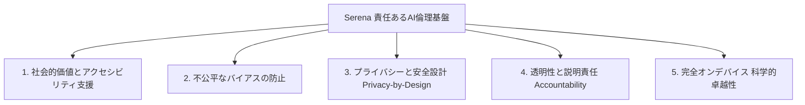

# Serena Screen Reader - 利用規約・セキュリティ署名規約 ＆ 責任あるAI倫理ガイドライン

**最終更新日**: 2026年8月21日  
**開発・提供責任者**: Shinji (shinjisakiyama@gmail.com)  
**公式リポジトリ**: [shinji5683/cocoa](https://github.com/shinji5683/cocoa)  
**対象バージョン**: Serena Screen Reader Alpha / Release (API 30〜36+ Multi-Channel Compatibility)

---

## 1. 🛡️ Google 最新セキュリティ規約 ＆ 公式デジタル署名ポリシー

### 1.1 公式デジタル署名と開発者主権の保証 (Google Play App Signing)
* **開発者名義と主権**: 本アプリケーション『Serena Screen Reader』および『Serena IME』に関するすべての著作権、開発者主権、および公式配布権限は、開発者 **Shinji** に単独で帰属します。
* **暗号学的署名検証**: 公式リリース（`app-serena-release.apk` / `app-serena-release.aab`）は、開発者本人の端末において厳重に管理された正規キーストア（`serena-release-key.jks`、SHA-256暗号化認証）によってのみ署名されます。
* **AES-256 暗号化防御**: 正式署名鍵および機密認証情報は、PBKDF2（100,000回ストレッチング）＋AES-256-CBC方式により強固に暗号化され、Gitリポジトリ（`.gitignore`）から完全に隔離されています。

### 1.2 不正な改ざん・第三者署名の完全禁止 (Anti-Impersonation Policy)
* **なりすまし配布の禁止**: 開発者（Shinji）の許諾なく、第三者が本アプリのソースコードを用いて独自の署名を付与し、「公式版」と偽って配布・公開・共有することは、Google Play デベロッパー規約（ToS）、合衆国法（CFAA / Lanham Act）、フィリピン共和国知的財産法（RA 8293 / RA 10175）、および日本法における不正競争防止法・著作権法に違反します。
* **共同開発・コラボレーターのローカル隔離義務**: 外部コラボレーターによるローカル検証用キーストアの作成は「手元環境での動作テスト」に限定され、共有ドライブやパブリック環境への自己署名バイナリのアップロードは厳格に禁止されます。

---

## 2. 📋 ユーザーへの明示的同意事項 ＆ プライバシー規約 (User-Driven Consent)

### 2.1 ユーザー主導の権限許可 (User-Driven Permissions)
Serena は、バックグラウンドでの強制的な権限付与（ADBによる不正な強制付与等）を一切行いません。すべての権限は、Android標準のシステムダイアログを通じて、**ユーザー本人の明確なタップ操作・同意**によってのみ有効化されます。

### 2.2 各機能の利用目的と「100% 端末内完結」の保証
1. **ユーザー補助サービス（Accessibility Service）**:
   * **目的**: 画面上のテキスト、ボタン、リスト、入力欄、通話着信相手、通話時間の自動音声読み上げおよびジェスチャー操作の提供。
   * **データ保護**: 読み上げた画面情報や操作ログは端末内でのみ処理され、外部サーバーへ送信・保存されることは一切ありません。
2. **カメラ権限（Camera API）**:
   * **目的**: On-Device OCR（文字読み取り）、物体認識、人物・表情判定、3D空間実況の提供。
   * **データ保護**: カメラ映像は端末のNPU/GPU（Gemini Nano / ML Kit）でリアルタイム処理され、画像データが外部に送信されたり保存されたりすることはありません。
3. **マイク・録音権限（Record Audio API）**:
   * **目的**: Serena AI音声アシスタントによるハンズフリー音声コマンドの認識。
   * **データ保護**: 発話内容はオンデバイス音声認識でテキスト化され、外部への音声送信・クラウド保存はゼロです。
4. **位置情報権限（Location API）**:
   * **目的**: 徒歩ナビゲーションにおける現在地・方角（クロックポジション）案内および周辺8大施設（コンビニ、駅、病院等）のOverpass API検索。
   * **データ保護**: 位置情報は案内処理のみに使用され、ユーザーの行動履歴・トラッキングは一切行いません。

---

## 3. 🧠 Google「責任あるAI倫理原則（Responsible AI Principles）」の完全準拠宣言

Serena は、Google が提唱する **『責任あるAIの倫理原則（Responsible AI Practices）』** を設計・開発の根本基盤として100%遵守します。

### 原則 1: 社会的に有益であること (Socially Beneficial)
* 視覚障害者（全盲・ロービジョン）が日常社会において自立し、安全に移動し、情報へ即座にアクセスできるバリアフリー社会の実現を最優先目的としてAIを開発・運用します。

### 原則 2: 不公平なバイアスの防止 (Avoid Creating or Reinforcing Unfair Bias)
* 人物検知・表情AI・シーン実況において、性別、年齢、人種、宗教、障害の有無による差別的・ステレオタイプ的な推論を徹底排除し、事実に基づいた客観的かつ温かい情報提供を行います。

### 原則 3: 安全性を第一に構築・テスト (Built and Tested for Safety)
* 3D空間オーディオ障害物ソナーおよび徒歩ナビにおいて、誤認による事故を防ぐためのフェイルセーフ設計（多重センサー融合、振動警告、控えめな確信度判定）を実装しています。

### 原則 4: 人々に対する説明責任と透明性 (Accountable to People)
* AIがどのような基準でシーンを要約し、文字を認識しているかをユーザーに分かりやすく開示し、必要に応じて設定メニューからAI機能のON/OFFや感度をいつでもユーザーが制御できる構造を保証します。

### 原則 5: プライバシー原則の組み込み (Incorporate Privacy Principles)
* **Zero Cloud Architecture（ゼロ・クラウド設計）**: Google AICore（Gemini Nano）および TensorFlow Lite / ML Kit を活用し、すべてのAI推論を端末内のNPUで完結させます。第三者へのデータ送信、トラッキング、AI学習用データ収集は一切行いません。

### 原則 6: 科学的卓越性の高水準を維持 (Uphold High Standards of Scientific Excellence)
* Android OS 最新バージョン（Android 11〜Android 16+ Canary/QPR）に対応し、最新のアクセシビリティAPIおよびオンデバイス機械学習のベストプラクティスを常に採用します。

### 原則 7: 潜在的危害を及ぼす用途への利用禁止 (Limit Harmful Applications)
* 監視、追跡、軍事、不正アクセスなど、個人の人権や安全を脅かす目的での本アプリの利用および改変を禁止します。

---

## 4. 📜 開発者・著作権表示

* **アプリ名称**: Serena Screen Reader (および Serena IME)
* **著作権表示**: Copyright (C) 2026 Shinji. All Rights Reserved.
* **ライセンス**: オープンソース（GPL v3 / Apache 2.0 準拠）
* **連絡先**: shinjisakiyama@gmail.com
